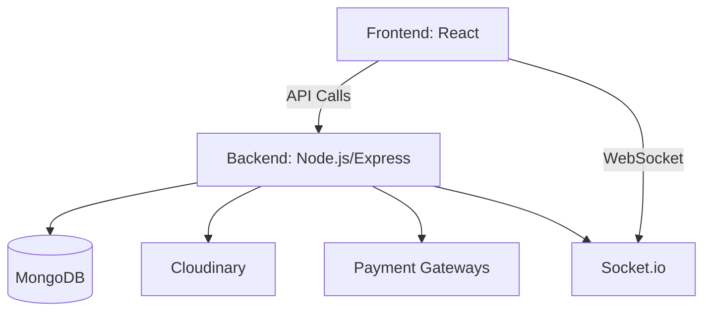

# **AgriCart - Multi-Vendor Agricultural E-Commerce Platform**  

  

🚀 **Backend is Complete – Frontend development in progress!** 🌱 *(Under Construction)*  

---

## **Table of Contents**
1. [Project Overview](#project-overview)  
2. [Key Features](#key-features)  
3. [System Architecture](#system-architecture)  
4. [API Documentation](#api-documentation)  
5. [Project Structure](#project-structure)  
6. [Installation Guide](#installation-guide)  
7. [Configuration](#configuration)  
8. [Dependencies](#dependencies)  
9. [Testing](#testing)  
10. [Deployment](#deployment)  
11. [Contributing](#contributing)  
12. [License](#license)  

---

## **Project Overview**  
AgriCart is a powerful **multi-vendor e-commerce platform** that connects **farmers directly with buyers**, eliminating middlemen and ensuring fair trade. It offers an intuitive interface, seamless transactions, and robust inventory management.  

**🌍 Target Users:**  
✅ Small-scale farmers  
✅ Agricultural buyers (restaurants, retailers, individuals)  
✅ System administrators  

---

## **Key Features**  

### **🛡 User Management**  
✅ **Role-based authentication** – JWT-secured login for **farmers, buyers, and admins**  
✅ **Profile management** – Users can update personal information  
✅ **Email verification** – Secure account activation flow  

### **🛒 Product System**  
✅ **Product listings** – Farmers can add/edit/delete products  
✅ **Inventory tracking** – Real-time stock updates  
✅ **Product search** – Filter by **category, price range, location**  

### **📦 Order Processing**  
✅ **Multi-vendor cart** – Buyers can purchase from multiple farmers in one order  
✅ **Order tracking** – Real-time status updates *(Pending → Shipped → Delivered)*  
✅ **Payment integration** – **M-Pesa, PayPal, and Stripe**  

### **💬 Communication**  
✅ **Real-time chat** – **Socket.io powered messaging**  
✅ **Notifications** – Email and in-app alerts  

### **📊 Analytics**  
✅ **Sales reports** – Graphical data visualization  
✅ **Farmer analytics** – Performance metrics for vendors  
✅ **Admin dashboard** – System-wide monitoring  

---

## **System Architecture**  


---

## **API Documentation**  

### **Base URL:**  
`https://api.agricart.com/v1` *(Development: `http://localhost:5000/api`)*  

### **Authentication**  
All endpoints (except auth) require:  
```http
Authorization: Bearer <JWT_TOKEN>
```

### **🛠 API Endpoints**  

#### **Auth Routes**  
| Method | Endpoint | Description | Access |  
|--------|----------|-------------|--------|  
| POST | `/auth/register` | Register new user | Public |  
| POST | `/auth/login` | User login | Public |  

#### **Product Routes**  
| Method | Endpoint | Description | Access |  
|--------|----------|-------------|--------|  
| GET | `/products` | Get all products | Public |  
| GET | `/products/search` | Search products | Public |  
| POST | `/products` | Create product | Farmer |  
| PUT | `/products/:id` | Update product | Farmer (owner) |  
| DELETE | `/products/:id` | Delete product | Farmer (owner) |  

#### **Order Routes**  
| Method | Endpoint | Description | Access |  
|--------|----------|-------------|--------|  
| POST | `/orders` | Create new order | Buyer |  
| GET | `/orders/myorders` | Get user's orders | Owner |  
| PUT | `/orders/:id/pay` | Mark as paid | Buyer |  
| PUT | `/orders/:id/deliver` | Mark as delivered | Farmer/Admin |  

*(Full API documentation available in `/documentation/api-spec.yaml`)*  

---

## **Project Structure**  

### **Backend**  
```
backend/
├── config/           # Configuration files  
│   ├── db.js         # Database connection  
│   └── cloudinary.js # Image upload config  
├── controllers/      # Business logic  
├── middleware/       # Auth and validation  
├── models/           # MongoDB schemas  
├── routes/           # API endpoints  
├── utils/            # Helpers and services  
│   ├── emailService.js  
│   └── generateToken.js  
└── server.js         # Entry point  
```

### **Frontend (🚧 Under Construction 🚧)**  
```
frontend/
├── public/           # Static assets  
└── src/
    ├── assets/       # Images, fonts  
    ├── components/   # Reusable UI  
    ├── features/     # Redux slices  
    ├── pages/        # Route components  
    ├── store/        # Redux configuration  
    ├── App.jsx       # Main component  
    └── main.jsx      # Entry point  
```

---

## **Installation Guide**  

### **🔧 Prerequisites**  
- **Node.js v16+**  
- **MongoDB Atlas** account or local MongoDB  
- **Cloudinary account** *(for image uploads)*  

### **📥 Setup Steps**  
1️⃣ Clone repository:  
   ```bash
   git clone https://github.com/aizocraft/agricart.git
   cd agricart
   ```  
2️⃣ Install backend dependencies:  
   ```bash
   cd backend
   npm install
   ```  
3️⃣ Install frontend dependencies *(🚧 Under Construction 🚧)*:  
   ```bash
   cd ../frontend
   yarn install
   ```  
4️⃣ Set up environment variables (`.env` files in both folders)  

---

## **Configuration**  

### **Backend (`.env`)**  
```ini
MONGO_URI=mongodb+srv://<username>:<password>@cluster.mongodb.net/agricart
JWT_SECRET=your_jwt_secret_key
CLOUDINARY_CLOUD_NAME=your_cloud_name
CLOUDINARY_API_KEY=your_api_key
CLOUDINARY_API_SECRET=your_api_secret
MPESA_CONSUMER_KEY=your_mpesa_key
MPESA_CONSUMER_SECRET=your_mpesa_secret
```

### **Frontend (`.env`) (🚧 Under Construction 🚧)**  
```ini
VITE_API_BASE_URL=http://localhost:5000/api
VITE_SOCKET_URL=http://localhost:5000
```

---

## **Dependencies**  

### **Backend**  
```json
"dependencies": {
  "express": "^4.18.2",
  "mongoose": "^7.0.3",
  "bcryptjs": "^2.4.3",
  "jsonwebtoken": "^9.0.0",
  "cloudinary": "^1.37.0",
  "socket.io": "^4.6.1",
  "nodemailer": "^6.9.1"
}
```

### **Frontend (🚧 Under Construction 🚧)**  
```json
"dependencies": {
  "react": "^18.2.0",
  "react-router-dom": "^6.10.0",
  "redux": "^4.2.1",
  "axios": "^1.3.5",
  "socket.io-client": "^4.6.1",
  "tailwindcss": "^3.3.0"
}
```

---

## **Testing**  
```bash
# Backend tests  
cd backend  
npm run test  
```  

🚧 **Frontend testing not yet implemented**  

---

## **Deployment**  

### **🌐 Backend** – **Deployed on Render**  
🔗 URL: *(To be updated)*  

### **🌍 Frontend** – **🚧 Under Construction 🚧**  
🔗 URL: *(To be updated)*  

---

## **Contributing**  
💡 Fork the repository → Create a branch → Commit changes → Push → Open a PR  

---

## **License**  
📜 Distributed under the **MIT License**  

---

📩 **Contact:**  
💻 **Developer:** Isaac Kariuki  
📧 **Email:** kariukiisaac911@gmail.com  
🔗 **Project:** [GitHub](https://github.com/aizocraft/agricart)