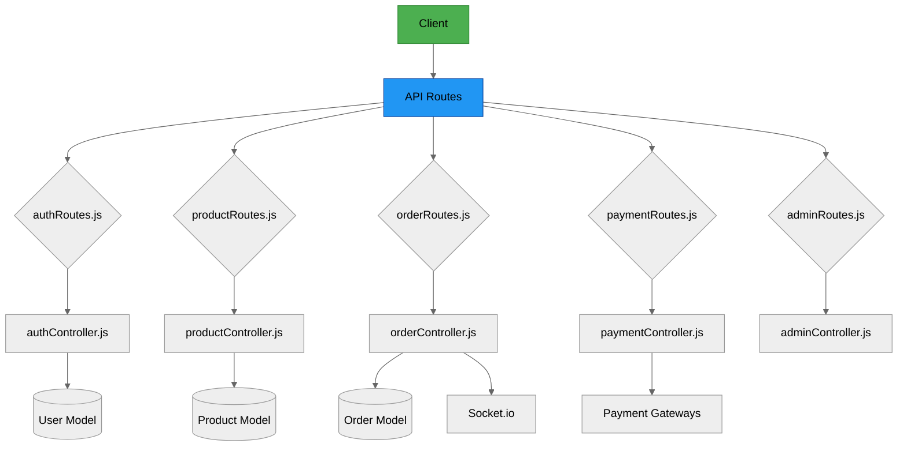
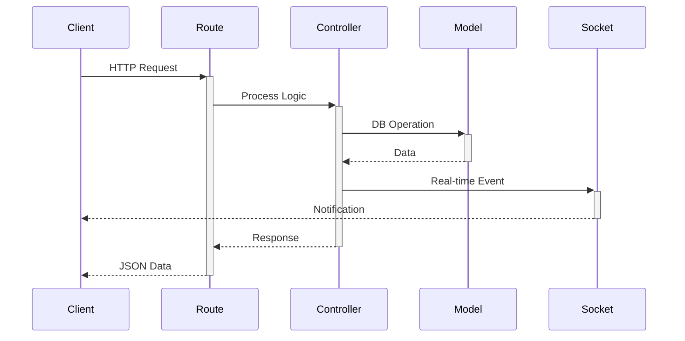
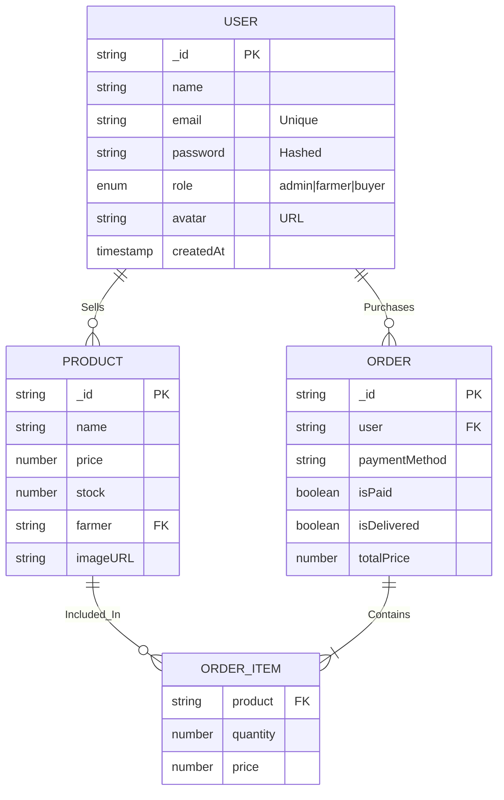
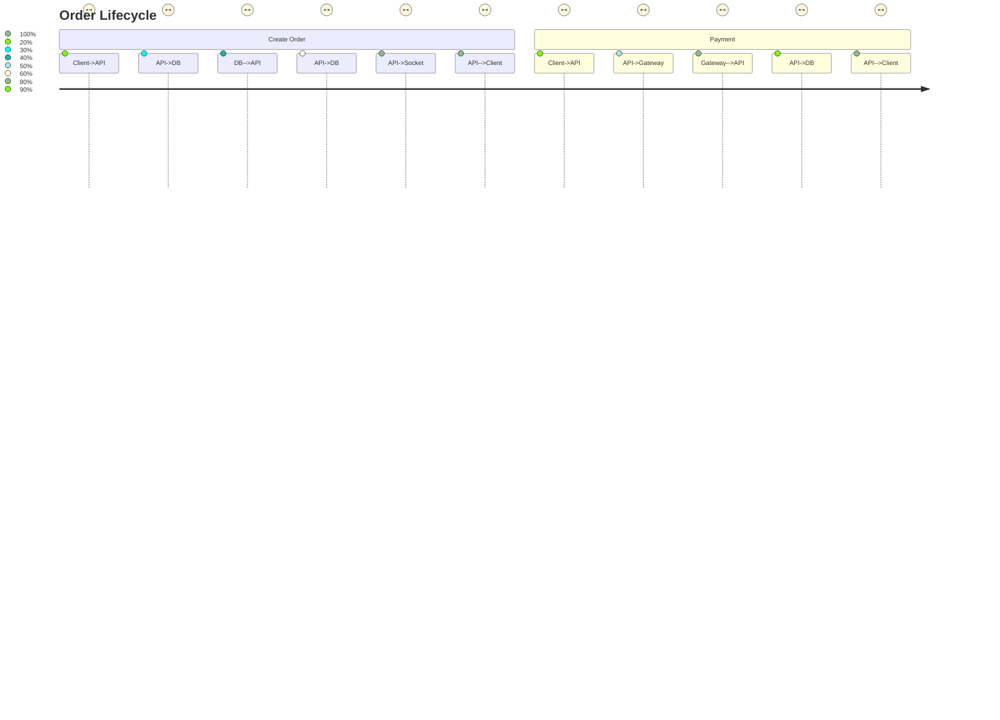

---

# 🚜 AgriCart Multivendor Backend API

<div align="center">
  


</div>

## 🌐 Complete Project Flow



## 📂 Exact File Structure (Your Project)

```
backend/
├── 📜 server.js                 # Entry point with Socket.io
│
├── 📁 controllers/              # Business logic
│   ├── authController.js        # User auth (JWT)
│   ├── productController.js     # Product management
│   ├── orderController.js       # Order processing
│   ├── paymentController.js     # PayPal/MPesa
│   └── adminController.js       # Admin operations
│
├── 📁 middleware/               # Request processing
│   ├── authMiddleware.js        # JWT protection
│   └── errorMiddleware.js       # Error handling
│
├── 📁 models/                   # MongoDB Schemas
│   ├── User.js                  # User accounts
│   ├── Product.js               # Vendor products
│   └── Order.js                 # Transactions
│
├── 📁 routes/                   # API Endpoints
│   ├── authRoutes.js            # /api/auth
│   ├── productRoutes.js         # /api/products
│   ├── orderRoutes.js           # /api/orders
│   ├── paymentRoutes.js         # /api/payment
│   └── adminRoutes.js           # /api/admin
│
└── 📜 .env                      # Configuration
```

## 🔗 Endpoint Flow Visualization



## 🗃️ Enhanced Database Schema



## 🔄 System Workflows

### 1. Order Processing Flow


## 💻 Development Setup

1. **Install dependencies** (exact from your project):
   ```bash
   npm install express mongoose dotenv bcryptjs jsonwebtoken cors socket.io
   ```

2. **Configure environment** (your `.env` structure):
   ```ini
   MONGO_URI="mongodb://localhost:27017/agriCart"
   JWT_SECRET="your_secure_key_here"
   PORT=5000
   CLIENT_URL="http://localhost:5173"
   ```

3. **Run the server** (as per your setup):
   ```bash
   npm run dev
   ```

## 🌟 Key Features (From Your Codebase)

| Module          | Key Methods                          | Tech Used          |
|-----------------|--------------------------------------|--------------------|
| **Auth**        | `register()`, `login()`, `getMe()`   | JWT, bcrypt        |
| **Products**    | `createProduct()`, `searchProducts()`| MongoDB Text Search|
| **Orders**      | `createOrder()`, `updateToDelivered` | Socket.io          |
| **Payments**    | `processPayPal()`, `processMpesa()`  | Payment Gateways   |
| **Admin**       | `getStats()`, `updateUserRole()`     | RBAC               |

