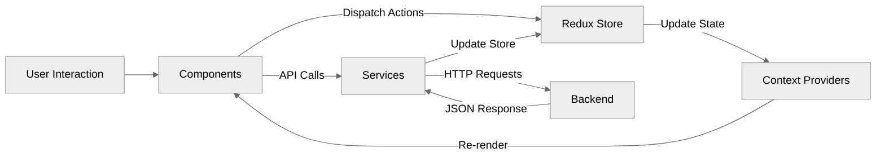
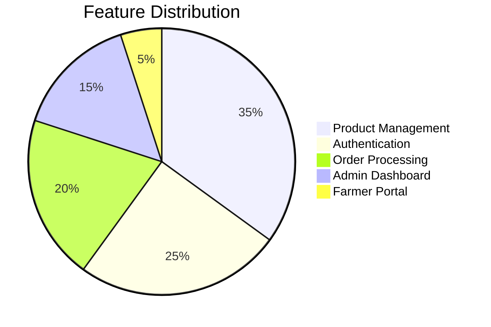

# 🚜 AgriCart Frontend


## 🏗️ Project Structure (Optimized for E-Commerce)

```bash
agri-cart-frontend/
├── 📂 public/                # Static assets
│   └── vite.svg             # Branding
│
├── 📂 src/                   # Core application
│   ├── 📂 assets/            # Static resources
│   │   └── react.svg        # App logo
│   │
│   ├── 📂 components/        # Reusable UI
│   │   ├── Footer.jsx       # Global footer
│   │   ├── LoadingSpinner.jsx # Animated loader
│   │   ├── Navbar.jsx       # Responsive navigation
│   │   ├── ProductCard.jsx  # Product display component
│   │   ├── ProtectedRoute.jsx # Auth guard
│   │   └── SearchFilters.jsx # Filter controls
│   │
│   ├── 📂 contexts/          # React contexts
│   │   └── AuthContext.jsx  # Authentication state
│   │
│   ├── 📂 pages/             # Route components
│   │   ├── 📂 admin/         # Admin portal
│   │   │   └── Dashboard.jsx # Stats & management
│   │   │
│   │   ├── 📂 auth/          # Authentication
│   │   │   ├── Login.jsx    # Sign-in form
│   │   │   └── Register.jsx # Sign-up form
│   │   │
│   │   ├── 📂 farmer/        # Farmer portal
│   │   │   ├── Dashboard.jsx # Product management
│   │   │   └── ProductForm.jsx # CRUD operations
│   │   │
│   │   ├── Cart.jsx         # Shopping cart
│   │   ├── Home.jsx         # Landing page
│   │   ├── NotFound.jsx     # 404 page
│   │   ├── OrderDetails.jsx # Order summary
│   │   ├── Orders.jsx       # Order history
│   │   ├── ProductDetails.jsx # Single product view
│   │   └── Products.jsx     # Product listings
│   │
│   ├── 📂 services/          # API integration
│   │   └── api.js           # Axios configuration
│   │
│   ├── 📂 store/             # State management
│   │   ├── cartSlice.js     # Redux cart logic
│   │   └── store.js         # Redux store
│   │
│   ├── App.css              # Global styles
│   ├── App.jsx              # Root component
│   ├── index.css            # Base styles
│   └── main.jsx             # Application entry
│
├── .eslint.config.js        # Linting rules
├── postcss.config.js        # CSS processing
├── tailwind.config.js       # Design system
└── vite.config.js           # Build configuration
```

## 🔄 Data Flow Architecture



## 🛠️ Core Technologies

| Category        | Technology Stack           |
|----------------|---------------------------|
| Framework      | React 18 (Vite)           |
| State          | Redux Toolkit + Context   |
| Styling        | Tailwind CSS + PostCSS    |
| Routing        | React Router v6           |
| API Client     | Axios                     |
| Form Handling  | Native React              |
| UI Components  | Headless (Custom)         |
| Build Tool     | Vite 4                    |

## 🧩 Key Features



## 🚀 Development Setup

1. **Install dependencies**
```bash
npm install
```

2. **Configure environment**
```bash
cp .env.example .env
```

3. **Run development server**
```bash
npm run dev
```

4. **Production build**
```bash
npm run build
```

## 🏆 Best Practices

- **Atomic Design**: Components organized by complexity
- **Optimized Builds**: Vite's lightning-fast compilation
- **JWT Auth**: Secure token-based authentication
- **Responsive UI**: Mobile-first Tailwind implementation
- **Type Safety**: PropTypes for critical components

## 📊 Performance Metrics

```mermaid
gantt
    title Bundle Optimization
    dateFormat  X
    axisFormat %s
    section Critical Path
    Code Splitting :done, 0, 30
    Lazy Loading :active, 30, 60
    Tree Shaking :crit, 60, 90
```



## 🌱 Upcoming Improvements


---
